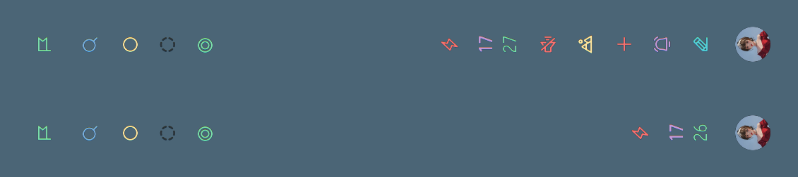
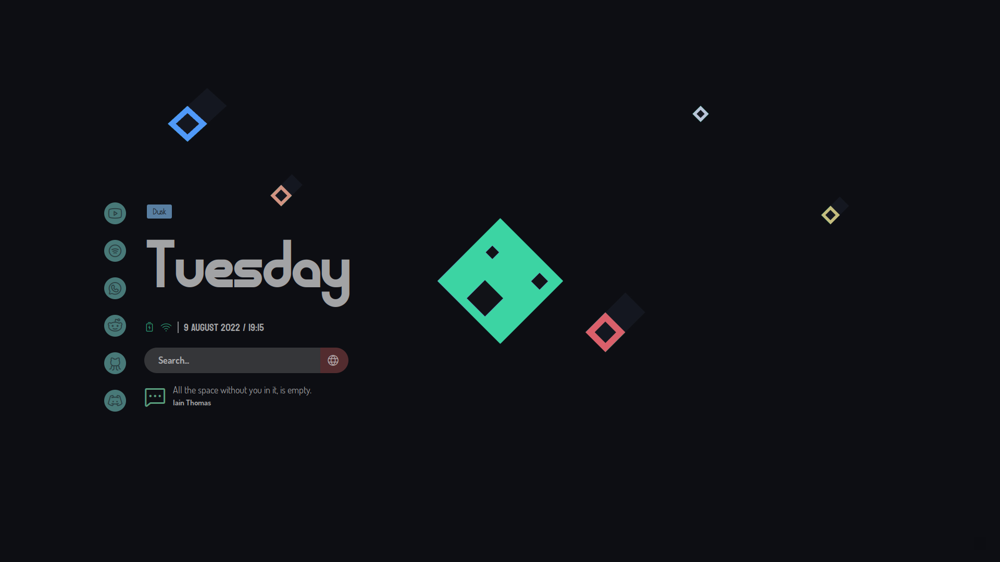

<div align="center">

[](https://github.com/dharmx/vile)

[](https://github.com/dharmx/vile/issues)
[](github.com/dharmx/vile)
[](https://github.com/dharmx/vile/stargazers)
[](https://github.com/dharmx/vile/commits)

</div>

# 👋 Introduction

Greetings, visitors. This is a repository of various useless GUI
[widgets](https://www.merriam-webster.com/dictionary/widget) that may or, may
not enchance the look of your current desktop interface.
I will walk you through each and every step of the installation process so,
make sure to hit that lik- follow everything in a step-by-step fashion.

And if you are here to borrow code then you may skip this README <samp>Obviously</samp>.

## 🚒 Procedure

A brief explanation of explanation (explanception!). This section is optional
but it wouldn't hurt to gloss over it.

- [Introduction, brief description and greetings.](https://github.com/dharmx/vile#-introduction)
- [Procedure, explanception.](https://github.com/dharmx/vile#-procedure)
- [Showcase. Brief showcase, two screenshots of the project in action.](https://github.com/dharmx/vile#-showcase)
- [Assumptions. Conditions and constraints.](https://github.com/dharmx/vile#-assumptions)
- [Structure. Project structure and design decisions.](https://github.com/dharmx/vile#-structure)
- <samp>MAKE IT STOP!</samp>
- [Dependencies. Modules, packages, scripts and resources that are required.](https://github.com/dharmx/vile#-dependencies)
- [Configuration. Setting things up.](https://github.com/dharmx/vile#configuration)
- [Hacking. Advanced configuration.](https://github.com/dharmx/vile#hacking)
- [Gallery.](https://github.com/dharmx/vile#gallery)
- [Samples.](https://github.com/dharmx/vile#samples)
- End Goals.
- Not Goals.
- Tips. Useless shit.
- FAQ.
- Credits. Acknowledgements.
- TODOs.
- License.

## 🖼 Showcase


## 🤔 Assumptions

List of conditions and constraints that are needed to be fulfilled.
This section solely to reduce some headaches.
This is done because I do not want to spend an extensive amount of time writing
instructions for several Linux distributions.

I will choose Archlinux as a reference frame as I have only used Archlinux,
Manjarno and EndeavourOS in the past.
So, following are roughly some assumptions that I will follow:

- You are using either Archlinux or, an Arch-based distro like Manjaro.
- You already have an editor, a browser and necessary utilities installed like
`sudo, git, etc`.
- You have `python` installed.
- You are using an [AUR helper](https://wiki.archlinux.org/title/AUR_helpers).
- You are using `bspwm` as your [window manager](https://wiki.archlinux.org/title/Window_manager).
- You are using `sxhkd` as your [keyboard daemon](https://wiki.archlinux.org/title/Keyboard_shortcuts).
- You use pulseaudio.

## 🌿 Structure

This is an important section for those who want to borrow some piece of
functionality for use in their projets.
This section will paint a general idea of how stuff is being linked to one
another so, you can have a general idea
for handling or, understanding a bug if one appears (which it will at some point).

### 🌿 General structure

```txt
├── assets
├── src
│   ├── scss
│   ├── shell
│   └── yuck
└── themes
```

- `assets` contains images, graphics and svgs for use in the project.
- `src.scss` contains all theming files. Theming is done using
[SCSS](https://sass-lang.com/). So, all of the files in this directory will also
be SCSS.
- `src.yuck` contains markup files, all of which are of YUCK filetype.
- `src.shell` contains various scripts.
- `themes` this will also contain only SCSS files.
<samp>Why not have them in src.scss then?</samp> Because organization. That's it.

### 🌿 `src` substructure

This structure will seem familiar to webdevs.

```txt
src
├── scss
│   ├── bolt
│   ├── lumin
│   └── vertigo
└── yuck
    ├── bolt
    ├── lumin
    └── vertigo
```

As you might have guessed.
The **modules** in the `scss` directory, style the classes that are defined in
the yuck directory.
For instance, the module `lumin` will have `scss.lumin` which will contain
styling specific to widgets defined in `yuck.lumin` only.

### 📚 Style Overrides

There is a `_override.scss` file which supplied for the purpose of overriding
and testing your own stylings.
I have made this in order to contain different designs for the same widget.

### Layouts

There is a `_layout.yuck` in every widget module
(eg: `src/yuck/lumin/_layout.yuck`) which acts like a mini-configuration.
Tweak the values if you wish to do so 😉.



The above is the transparent version of the bar which is different to that
shown in the showcase.

## 🔽 Dependencies

This section is divided into 2 parts:

- Main Dependencies
- Python Dependencies

### 🔽 Main Dependencies

Execute this in your terminal <samp>(if you dare.)</samp>.

```sh
yay --sync base-devel rustup python python-pip eww-git  \
  dunst bspwm sxkhd gobject-introspection imagemagick   \
  mpd mpc playerctl pamixer rofi redshift zsh jq todo-bin --needed
# NOTE: use paru or, a AUR helper of your choice or, do the dirty work yourself.
```

- [rustup](https://rustup.rs/) is needed for compiling eww.
- For [pipewire](https://wiki.archlinux.org/title/PipeWire) users you need to
replace all of the matches of [`pamixer`](https://github.com/cdemoulins/pamixer)
in
  this repository with appropriate commands. You may use [`nvim-telescope's live-grep`](https://github.com/nvim-telescope/telescope.nvim)
  feature to get the matches conveniently and elegantly.
- For [dunst](dunst-project.org) you need to have have a specific configuration,
which you can grab from the [**Samples**](https://github.com/dharmx/vile#samples)
section.
- And it should be a given that [`bspwm`](https://wiki.archlinux.org/title/Bspwm)
and [`sxkhd`](https://wiki.archlinux.org/title/Sxhkd) are already configured.

### 🔽 Python Dependencies

Inspect the packages that you are about to install from [`requirements.txt`](https://github.com/dharmx/vile/blob/main/requirements.txt).
Then run the following command in your terminal while in `vile's` root.

```sh
pip install --requirement=requirements.txt
```

## Configuration

Start by placing vile into `~/.config` and rename `vile` to `eww`. Or, you can use symlinks as shown below.

```sh
git clone --depth 1 https://github.com/dharmx/vile.git ~/Downloads
ln -s ~/Downloads/vile ~/.config/eww
## do not remove ~/Downloads/vile
```

Now, right after doing that you need to make the scripts executable.

```sh
chmod +x ~/Downloads/vile/src/shell/*
```

You need to install the fonts that are being used in this repo. Which can
be found [here](https://github.com/dharmx/dots.sh/tree/main/local/share/fonts).
Lastly, do not forget to update the font caches after you do install them
`fc-cache -frv`.

```txt
Caviar Dreams
Sagetarius
Phosphor
Dosis
Poiret One
monoMMM_5
Iosevka
Modum
Koulen
Feather
Lato
```

This is a very very very important section. As the previous one, this section
is also divided into various parts.

- Environment Variables.
- API Setups
- JSON / Script Configurations
- Layout Configurations
- Dependency Configurations
- Headless Testing / Trial Run.

### Environment Variables

Start by reading the [xdg-utils](https://wiki.archlinux.org/title/Xdg-utils)
and [xdg-vars](https://wiki.archlinux.org/title/XDG_user_directories) articles
from the [ArchWiki](https://wiki.archlinux.org/).
Then you need to setup those variables by adding some lines in your
[shellrc](https://www.tecmint.com/understanding-shell-initialization-files-and-user-profiles-linux/).
Anyways, I will be using [ZSH](https://zsh.sourceforge.io/)
for this so, we will add those environment variables by editing the `~/.zshenv`
file first (create it if it doesn't exist).

Then just append these lines to the file.

```zsh
export XDG_CONFIG_HOME="$HOME/.config"
export XDG_CACHE_HOME="$HOME/.cache"
export XDG_MUSIC_DIR="$HOME/Music"
export XDG_PICTURES_DIR="$HOME/Pictures"
```

On top of that you would need to add these as well.

```zsh
# NOTE: Add defaults of your choice as these may not be your taste.
export TERMINAL=st ## kitty for example
export BROWSER=firefox ## brave for example
export VISUAL=neovide ## nano for example
export EDITOR=nvim ## vim for example
```

See more info on what these variables do [here](https://wiki.archlinux.org/title/Environment_variables).

### API Setups

Starting with the easiest. Firstly you need to go to the
[OpenWeather](https://home.openweathermap.org/users/sign_in)
website and grab your [API key](https://rapidapi.com/blog/api-glossary/api-key/).
Do this by creating an account and logging into the site. Then go to
the [`api_keys`](https://home.openweathermap.org/api_keys) tab and press the
generate button after typing a name in the textfield.
And if you already have a default key then use that instead.

Anyways, take a note of that key value as we will need it later.

### JSON and Script Configurations

Copy the `ewwrc` from the [**Samples**](https://github.com/dharmx/vile#samples)
section and remove all of the comments. Then the first thing you'd need to do is
add the tokens that you noted from the
[previous](https://github.com/dharmx/vile#-dependencies) section.
For example the `tokens.openweather` field.

> Note: You may skip this if you do not plan to use `clime and chrono` see
the Galley section.

Take a look at the `location` key and see what method of fetching the location
you want to select. If you have selected manual method then you'd need to fill
out either `latitude` and `longitude` or, `city` and `country_code` and `lang` fields.
Learn more about these [here](https://openweathermap.org/history-bulk#parameter).
As for automatic, you do not need to do anything in the location field.

Then customize, change and tweak the values to your liking.

Now, open `src/shell/combine.bash` then edit and match the `CACHE_PATH`,
`QUOTE_PATH`, `INTERVAL` and `DEFAULT_QUOTE` with the fields
`notify.cache_path`, `notify.quote_path`,
`notify.default_quote` and `notify.interval` from `ewwrc`.

> Note: `combine.bash` is created to be an alternative for some `logger.py
functions since it is quite slow.

### Layout Configurations

Moving on. Copy the sample `eww.yuck` from the
[**Samples**](https://github.com/dharmx/vile#samples) section. Create the
`eww.yuck` file and uncomment the widgets you need. You may take a look at the
[**Gallery**](https://github.com/dharmx/vile#gallery) section.

As explained in the [**Structure**](https://github.com/dharmx/vile#-structure)
section open the layout files of the modules that you enabled. For example
if you have uncommented the vertigo module then, you would
need to open `src/yuck/vertigo/_layout.yuck` file and _customize_ the values
like icons glyphs, labels, etc.

For example in the `bolt` widget if you change the `:volume_icon`
field i.e. `` to a smiley face `:)` then

```lisp
;; NOTE: can be found in src/yuck/bolt/_layout.yuck
(_boltpctl :cover {pctl_sub["mpris:artUrl"]}
           :label {pctl_sub["status"]}
           :title {pctl_sub["xesam:title"]}
           :artist {pctl_sub["xesam:artist"]}
           :volume volume_level
           :volume_icon "" ;; to :volume_icon ":)"
           :status_cmd "playerctl play-pause"
           :status_icon {pctl_sub["status"] == "Playing" ? "" : ""})
```


### Dependency Configurations

- Make sure you have playerctl running at all times. Execute `playerctld daemon`
in your terminal to start playerctl.
- MPD needs to be running all times as well. Execute `mpd` in your terminal.
- Same goes for dunst. Only caveat is that you'd need a specific configuration
for making it work with the `disclose` module.

#### Disclose: Notification Manager

There are some very specific things that you would need to do for setting this up.
Firstly, grab or, inspect the sample `dunstrc` from the
[**Samples**](https://github.com/dharmx/vile#samples) section.
Take a good look at the rulesets:

```ini
[volume]
appname = "volume"
summary = "*"
set_stack_tag = "volume"
format = "<b>%s</b>\n%b"

[firefox]
appname = firefox
new_icon = firefox-default
```

The above is an example of said ruleset. When a notification is sent by a certain
application like for example firefox, they will send
some specific metadata on top of the usual message summary and message body.
Which then we can use to tell apart the notifications sent from
firefox and other applications. This is done using the `appname` value.

We take that value and match it to these ruleset's `appname` field. And if you
have looked at the above snippet carefully, you will notice that there is a
rule called `[firefox]` and within it there is a field called `appname` whose
value is `firefox`.
Now, whenever Firefox browser sends us a notification it will be redirected to
that ruleset.

Secondly, there is another field called `new_icon` which signifies that when
Firefox sends a notification, the notification icon will be replaced with an icon
from your icon theme named `firefox-default.svg` (Yes, the extension will be truncated).


### Testing

This section will describe how you would know if the script actually works.
Since, if the scripts work then most probably the widgets will work as well.
These (might) be automated later in the near future with unit testing.

Before we begin I would urge you to recheck and verify if all the XDG variables
have been set or not. Source the `~/.zshenv` again if you are not confident.

Now, go to the root of the vile repo. Then change the directory to where all of
the scripts are located at `cd src/shell`.

- <samp>logger.py</samp>: Run this using `./logger.py init` which will
   initialize the[dbus](https://www.freedesktop.org/wiki/Software/dbus) eavesdropper.
   Now, open another terminal and run `./logger.py subscribe` then open another
   terminal and type `notfy-send hello`. Now, if something appears in the second
   terminal then the script is working.

   ```lisp
   (box :spacing 20 :orientation 'vertical' :space-evenly false
   (_cardimage :class 'Spotify-rectangle' :identity ':::###::::
   XXXWWW1660034424===::' :close_action './src/shell/combine.bash
   rmid 1660034424' :limit_body '110' :limit_summary '30' :summary
   'Forbidden Silence' :body 'Raimu - Forbidden Silence' :close '繁'
   :class 'Spotify-rectangle' :identity ':::###::::XXXWWW1660034279===::'
   ...
   ```

- <samp>combine.bash</samp>: Run this using `./logger.py init` which will
initialize the [dbus](https://www.freedesktop.org/wiki/Software/dbus) eavesdropper.
   Now, open another terminal and run `./combine.bash sub` then open another
   terminal and type `notfy-send hello`. Now, if something appears in the
   second terminal then the script is working. Sample should be the same as `logger.py`.
- <samp>covidstate.py</samp>: This is currently not in use but you can test it regardless.
Try running it `./covidstate.py` and see if there is any
[JSON](https://www.json.org/json-en.html) output.
   You may need to wait for a few seconds by the way. Following is a sample.

   ```json
   {
     "country": {
     <redacted>: {
       "id": "81",
       "country": <redacted>,
       "confirmed": 44174650,
       "active": null,
       "deaths": 526772,
       "recovered": null,
   ...
   ```

- <samp>github.sh</samp>: This too is not being used but wouldn't hurt to test it.
Try running it by `./github.sh repos` see if there is any JSON output. And do the
same for `./github.sh users` as well.
   Following is a sample.

   ```json
   [
     {
       "id": <some_number>,
       "node_id": <some_number>,
       "name": "dharmx",
       "full_name": "dharmx/dharmx",
       "private": false,
       "owner": {
         "login": "dharmx",
   ...
   ```

- <samp>pollution.py</samp>: Do the same as `github.sh`.  Following is a sample.

   ```json
   {
     "coord": {
     "lon": <redacted>,
     "lat": <redacted>
   },
   "list": [
     {
       "main": {
       "aqi": 3
     },
     "components": {
       "co": 487.33,
       "no": 0.13,
       "no2": 21.08,
       "o3": 39.34,
       "so2": 31.47,
       "pm2_5": 20.35,
       "pm10": 24.43,
       "nh3": 4.75
   ...
   ```

- <samp>weather.py</samp>: Do the same as `github.sh` only difference is
that you need to supply a flag i.e. `fetch`.
   Following is a sample.

   ```json
   {
     "coord": {
     "lon": <redacted>,
     "lat": <redacted>
   },
   "weather": [
     {
       "id": 721,
       "main": "Haze",
       "description": "haze",
       "icon": "50d",
   ...
   ```

- <samp>workspaces.zsh</samp>: This is [BSPWM](https://github.com/baskerville/bspwm) specific.
Try running this by `./workspaces.zsh subscribe_desktop` then try going to any
other workspace then return to the current one.
   Now, see if there are any JSON values. Following is a sample.

   ```json
   [
     {
       "class": "vertigo-button vertigo-workspace vertigo-workspace-occupied",
       "tooltip": "workspace:  state: occupied",
       "onclick": "bspc desktop --focus 1",
       "label": ""
     },
     {
       "class": "vertigo-button vertigo-workspace vertigo-workspace-local",
       "tooltip": "workspace:  state: local",
       "onclick": "bspc desktop --focus 2",
       "label": ""
     },
     {
       "class": "vertigo-button vertigo-workspace vertigo-workspace-focused",
       "tooltip": "workspace: 北 state: focused",
       "onclick": "bspc desktop --focus 3",
       "label": "北"
     }
   ]
   ```

- <samp>mpdaemon.py</samp>: Same as `github.sh`. Also, you might need to
   traverse through your current MPD music playlist and play some songs to be
   completely sure.
   While you are at it see if JSON output changes or, not as well. Sample as follows.

   ```json
   {
     "file": "/home/maker/.cache/eww/mpd/3PM Coding Session.png",
     "artist": "Lofi Ghostie",
     "albumartist": "Unknown",
     "title": "3PM Coding Session",
     "album": "Unknown",
     "last-modified": "2021-11-14T19:55:40Z",
     "format": "44100:24:2",
     "time": "4948",
     "duration": "4947.748",
     "pos": "0",
     "id": "1",
     "status": "pause",
     "bright": "#4959A5",
     "dark": "#CC96E0"
   }
   ```

- <samp>playerctl.py</samp>: Similar to `mpdaemon.py`. Sample as follows.

   ```json
   {
     "mpris:artUrl": "/home/maker/.cache/eww/pctl/spotify/7468726565706F6F6C/4120506C6163652042656E65617468.png",
     "xesam:artist": "threepool",
     "xesam:title": "A Place Beneath",
     "xesam:album": "A Place Beneath",
     "status": "Playing",
     "mpris:trackid": "/com/spotify/track/4m1Kg8I715SQUSOjFrvxR7",
     "mpris:length": 132679000,
   ...
   ```

- <samp>uptime.awk</samp>: Run this by `uptime --pretty | ./uptime.awk`.
   Output should be `2d, 4h` for uptime of `up 2 days, 4 hours, 35 minutes`.

### Note

- If any of these do not work then consult the Troubleshooting, FAQ and Tips sections.
- The notification manager (disclose) depends on my custom made icon theme that
can be found [here](https://github.com/dharmx/dots.sh/tree/main/home/.icons/custom.bak).
- With dunst you may need to remove its dbus service file
`/usr/share/dbus-1/services/org.knopwob.dunst.service`. Then kill all dunst
instances and start again with a new instance.
- There may be some difficulties with the `mpdaemon.py` script if your default
mpd Music storage is not as same as `XDG_MUSIC_DIR` i.e. `~/Music`.

## Hacking

Coming Soon...

## Gallery

|  Avatar  |
|---------|
|   |
| **Description**: Adaptive and dynamic music player daemon and playerctl frontends. |
| Note that this is still incomplete. |

|   Bolt   |
|---------|
|   |
| **Description**: Beautiful integrated bar mini-dashboard. |

|   Disclose   |
|---------|
|   |
| **Description**: Feature-Rich and Hacky notification manager. |

|   Vertigo   |
|---------|
|   |
| **Description**: BSPWM Specific bar. See the [**Hacking**](https://github.com/dharmx/vile#hacking) section to add support for your WM. |

|  Chrono One  |  Chrono Two  |
|---------|---------|
|   |   |
| **Description**: Calendar, Cool radial clock and a beautiful weather card. | **Description**: Extensive weather information and Air pollution information. |

|   Lumin   |
|---------|
|   |
| **Description**: Shows time and searches searches stuff on [duckduckgo](duckduckgo.com). |

|   Clime   |
|---------|
|   |
| **Description**: Minimal weather info. |

|   Origin   |
|---------|
|   |
| **Description**: Shows current logged username and hostname. |

|   Melody   |
|---------|
|   |
| **Description**: Shows current playing audio track with essential application icons. |

|   Ocular   |
|---------|
|   |
| **Description**: A moving seconds clock with added Ram, CPU, Temperatue and Battery monitor. |

## Samples

<details>
<summary>A sample <code>dunstrc</code> configuration.</summary>

```ini
[global]
background = "#11161b"
foreground = "#d4d4d5"
monitor = 0
follow = mouse
width = 480
height = 380
progress_bar = true
progress_bar_height = 25
progress_bar_frame_width = 3
progress_bar_min_width = 460
progress_bar_max_width = 480
highlight = "#79dcaa"
dmenu = /usr/bin/dmenu
indicate_hidden = true
shrink = true
transparency = 5
separator_height = 5
padding = 10
horizontal_padding = 10
frame_width = 3
frame_color = "#151a1f"
sort = true
idle_threshold = 0
font = Dosis,Iosevka Nerd Font 14
line_height = 2
markup = full
origin = "top-right"
offset = "50x50"
format = "<b>%s</b>\n%b"
alignment = left
show_age_threshold = 60
word_wrap = false
ignore_newline = true
stack_duplicates = true
hide_duplicate_count = true
show_indicators = true
icon_position = left
max_icon_size = 128
min_icon_size = 104
icon_theme = "custom,Reversal-green-dark,McMuse-green,Zafiro,McMuse,Papirus"
enable_recursive_icon_lookup = true
sticky_history = true
history_length = 50
browser = firefox
always_run_script = true
title = Dunst
class = Dunst
corner_radius = 0
notification_limit = 5
mouse_left_click = do_action
mouse_middle_click = close_current
mouse_right_click = context_all
ignore_dbusclose = true
ellipsize = end

[urgency_low]
timeout = 4
background = "#11161b"
frame_color = "#1f2429"
foreground = "#79dcaa"

[urgency_normal]
timeout = 8
background = "#11161b"
frame_color = "#1f2429"
foreground = "#7ab0df"

[urgency_critical]
timeout = 30
background = "#11161b"
frame_color = "#1f2429"
foreground = "#f87070"

[fullscreen_show_critical]
msg_urgency = critical
fullscreen = pushback

[volume]
appname = "volume"
summary = "*"
set_stack_tag = "volume"
format = "<b>%s</b>\n%b"

[microphone]
appname = "microphone"
summary = "*"
set_stack_tag = "microphone"
format = "<b>%s</b>\n%b"

[audiojack]
appname = "audiojack"
summary = "*"
set_stack_tag = "audiojack"
format = "<b>%s</b>\n%b"

[brightness]
appname = "brightness"
summary = "*"
set_stack_tag = "brightness"
format = "<b>%s</b>\n%b"

[shot]
appname = "shot"
summary = "*"
set_stack_tag = "shot"
format = "<b>%s</b>\n%b"

[shot_icon]
appname = "shot_icon"
summary = "*"
set_stack_tag = "shot_icon"
format = "<b>%s</b>\n%b"

[bar]
appname = "bar"
summary = "*"
set_stack_tag = "bar"
format = "<b>%s</b>\n%b"

[nightmode]
appname = "nightmode"
summary = "*"
set_stack_tag = "nightmode"
format = "<b>%s</b>\n%b"

[sxhkd]
appname = "sxhkd"
summary = "*"
set_stack_tag = "sxhkd"
format = "<b>%s</b>\n%b"

[layouts]
appname = "layouts"
summary = "*"
set_stack_tag = "layouts"
format = "<b>%s</b>\n%b"

[bspwm]
appname = "bspwm"
summary = "*"
set_stack_tag = "bspwm"
format = "<b>%s</b>\n%b"

[todo]
appname = "todo"
summary = "*"
set_stack_tag = "todo"
format = "<b>%s</b>\n%b"
new_icon = custom-to-do
background = "#161b20"
foreground = "#c397d8"

[picom]
appname = "picom"
summary = "*"
set_stack_tag = "picom"
format = "<b>%s</b>\n%b"

[spotify]
appname = "spotify"
summary = "*"
set_stack_tag = "spotify"
format = "<span size='x-large' font_desc='Cooper Hewitt 12' weight='bold' foreground='#79dcaa'>%s</span>\n%b"

[mpd]
appname = "mpd"
summary = "*"
set_stack_tag = "mpd"
format = "<span size='x-large' font_desc='Cooper Hewitt 12' weight='bold' foreground='#c397d8'>%s</span>\n%b"

[firefox]
appname = firefox
new_icon = firefox-default

[network]
appname = network
new_icon = network
summary = "*"
format = "<span size='x-large' weight='bold'>%s</span>\n<span font_desc='Cooper Hewitt,Iosevka Nerd Font 12'>%b</span>"

# vim:filetype=dosini
```

</details>

<details>
<summary>A sample <code>eww.yuck</code> configuration.</summary>

```lisp
(include "./src/yuck/_env.yuck")
(include "./src/yuck/_lib.yuck")

;; (include "./src/yuck/vertigo/_init.yuck")
;; (include "./src/yuck/disclose/_init.yuck")
;; (include "./src/yuck/avatar/_init.yuck")
;; (include "./src/yuck/melody/_init.yuck")
;; (include "./src/yuck/lumin/_init.yuck")
;; (include "./src/yuck/origin/_init.yuck")
;; (include "./src/yuck/ocular/_init.yuck")
;; (include "./src/yuck/clime/_init.yuck")
;; (include "./src/yuck/power/_init.yuck")
;; (include "./src/yuck/chrono/_init.yuck")
;; (include "./src/yuck/bolt/_init.yuck")

; vim:filetype=yuck
```

</details>

<details>
<summary>A sample <code>ewwrc</code> configuration.</summary>

```json
{
  "player": {
    "mpd_cache": "$XDG_CACHE_HOME/eww/mpd",
    "pctl_cache": "$XDG_CACHE_HOME/eww/pctl",
    "default_art": "$XDG_CONFIG_HOME/eww/assets/cover.png"
  },
  "desktops": {
    "states": {
      "focused": "\uf963",
      "occupied": "\uf75a",
      "urgent": "\ufa44",
      "empty": "\uf75b"
    },
    "tags": {
      "hidden": "\ue95f",
      "sticky": "\ue9ad",
      "private": "\uea08",
      "locked": "\ue98f",
      "marked": "\ue9da",
      "empty": "\ue998"
    },
    "layouts": {
      "monocle": "\uf70d",
      "tiled": "\uf817",
      "fullscreen": "\uf749",
      "pseudo_tiled": "\uf752",
      "floating": "\uf70e",
      "empty": "\uf849"
    }
  },
  "network": {
    "interface": "CURRENTLY_NOT_IN_USE"
  },
  "notify": {
    "limit": 50,
    "interval": 0.5,
    "cache_path": "$XDG_CACHE_HOME/eww/dunst/notifications.txt",
    "quote_path": "$XDG_CACHE_HOME/eww/dunst/quotes.txt",
    "default_quote": "To fake it is to stand guard over emptiness. \u2500\u2500 Arthur Herzog",
    "timestamp": "%H:%M",
    "excluded_appnames": null
  },
  "location": {
    "method": "automatic",
    "cache_dir": "$XDG_CACHE_HOME/eww/location",
    "latitude": null,
    "longitude": null,
    "city": null,
    "country_code": null,
    "lang": null,
    "zip": null
  },
  "tokens": {
    "openweather": "641f54ef8b6cc337c7ea7e6d3881730d",
    "gmail": "CURRENTLY_NOT_IN_USE"
  },
  "weather": {
    "units": "metric",
    "cache_dir": "$XDG_CACHE_HOME/eww/weather",
    "icons": {
        "01d": "",
        "02d": "",
        "03d": "",
        "04d": "",
        "09d": "",
        "10d": "",
        "11d": "",
        "13d": "",
        "50d": "",
        "01n": "",
        "02n": "",
        "03n": "",
        "04n": "",
        "09n": "",
        "10n": "",
        "11n": "",
        "13n": "",
        "50n": "",
        "default": ""
    },
    "images": {
        "01d": "$XDG_CONFIG_HOME/eww/assets/01.jpg",
        "02d": "$XDG_CONFIG_HOME/eww/assets/02.jpg",
        "03d": "$XDG_CONFIG_HOME/eww/assets/03.jpg",
        "04d": "$XDG_CONFIG_HOME/eww/assets/04.jpg",
        "09d": "$XDG_CONFIG_HOME/eww/assets/09.jpg",
        "10d": "$XDG_CONFIG_HOME/eww/assets/10.jpg",
        "11d": "$XDG_CONFIG_HOME/eww/assets/11.jpg",
        "13d": "$XDG_CONFIG_HOME/eww/assets/13.jpg",
        "50d": "$XDG_CONFIG_HOME/eww/assets/50.jpg",
        "01n": "$XDG_CONFIG_HOME/eww/assets/01.jpg",
        "02n": "$XDG_CONFIG_HOME/eww/assets/02.jpg",
        "03n": "$XDG_CONFIG_HOME/eww/assets/03.jpg",
        "04n": "$XDG_CONFIG_HOME/eww/assets/04.jpg",
        "09n": "$XDG_CONFIG_HOME/eww/assets/09.jpg",
        "10n": "$XDG_CONFIG_HOME/eww/assets/10.jpg",
        "11n": "$XDG_CONFIG_HOME/eww/assets/11.jpg",
        "13n": "$XDG_CONFIG_HOME/eww/assets/13.jpg",
        "50n": "$XDG_CONFIG_HOME/eww/assets/50.jpg",
        "default": "$XDG_CONFIG_HOME/eww/assets/01.jpg"
    }
  },
  "covid": {
    "cache_dir": "$XDG_CACHE_HOME/eww/covid",
    "icons": {
      "country": "",
      "confirmed": "",
      "deaths": ""
    }
  },
  "pollution": {
    "cache_dir": "$XDG_CACHE_HOME/eww/pollution",
    "icons": {
      "good": "",
      "fair": "",
      "moderate": "",
      "poor": "",
      "very_poor": ""
    }
  },
  "github": {
    "cache_dir": "$XDG_CACHE_HOME/eww/github",
    "username": "dharmx"
  }
}
```

</details>

<details>
<summary>A sample <code>_override.scss</code> configuration.</summary>

```scss
// exclude eww-vertigo in picom shadows exclude section
// this is an example to override the default vertigo style
// and make the bar transparent. Enjoy.

// .vertigo-layout-box {
//   background-color: rgb(0, 0, 0, 0.0);
// }

// .vertigo-node-button-tiled { color: $base14; }
// .vertigo-node-button-monocle { color: $base11; }
// .vertigo-node-button-float { color: $base13; }
// .vertigo-node-button-pseudo { color: $base15; }
// .vertigo-node-button-full { color: $base09; }
// .vertigo-node-button-other { color: $base08; }
// .vertigo-node-button:hover { opacity: 0.8; }

// .vertigo-node-button-tiled,
// .vertigo-node-button-monocle,
// .vertigo-node-button-float,
// .vertigo-node-button-pseudo,
// .vertigo-node-button-full,
// .vertigo-node-button-other {
//   background-color: rgb(0, 0, 0, 0.0);
// }

// .vertigo-battery-button {
//   background-color: rgb(0, 0, 0, 0.0);
//   color: $base11;
// }

// .vertigo-time-button {
//   background-color: rgb(0, 0, 0, 0.0);
// }

// .vertigo-volume-on { background-color: rgb(0, 0, 0, 0.0); }
// .vertigo-volume-off { background-color: rgb(0, 0, 0, 0.0); }
// .vertigo-volume-on:hover { background-color: $base13; }
// .vertigo-volume-off:hover { background-color: $base11; }

// .vertigo-nightmode-on { background-color: rgb(0, 0, 0, 0.0); }
// .vertigo-nightmode-off { background-color: rgb(0, 0, 0, 0.0); }
// .vertigo-nightmode-on:hover { background-color: $base09; color: $shade01; }
// .vertigo-nightmode-off:hover { background-color: $base13; color: $shade01; }

// .vertigo-notify-on { background-color: rgb(0, 0, 0, 0.0); }
// .vertigo-notify-off { background-color: rgb(0, 0, 0, 0.0); }
// .vertigo-notify-on:hover { background-color: $base15; color: $base02; }
// .vertigo-notify-off:hover { background-color: $base11; color: $base02; }

// .vertigo-todo-button { background-color: rgb(0, 0, 0, 0.0); }
// .vertigo-todo-button:hover { background-color: $base07; color: $base01; }
// .vertigo-workspace-plus-button { background-color: rgb(0, 0, 0, 0.0); }
// .vertigo-workspace-plus-button:hover { background-color: $base11; color: $base02; }

// .vertigo-time-button:hover { background-color: rgb(0, 0, 0, 0.0); }

// .vertigo-separator {
//   opacity: 0.0;
// }

// .vertigo-search-button {
//   color: $base09;
//   background-color: rgb(0, 0, 0, 0.0);
// }

// .vertigo-search-button:hover { background-color: rgb(0, 0, 0, 0.0); color: $base07; }
// .vertigo-workspace { background-color: rgb(0, 0, 0, 0.0); }

// .vertigo-workspace:hover { background-color: rgb(0, 0, 0, 0.0); }
// .vertigo-workspace-focused {
//   background-color: rgb(0, 0, 0, 0.0);
//   border-right-color: rgb(0, 0, 0, 0.0);
// }

// .vertigo-workspace-occupied:hover { border-left-color: rgb(0, 0, 0, 0.0); }
// .vertigo-workspace-urgent:hover { border-left-color: rgb(0, 0, 0, 0.0); }
// .vertigo-workspace-local:hover { border-left-color: rgb(0, 0, 0, 0.0); }

// vim:ft=scss
```


</details>

<div align="center">

# ⚠  UNDER CONSTRUCTION ⚠

<div>
