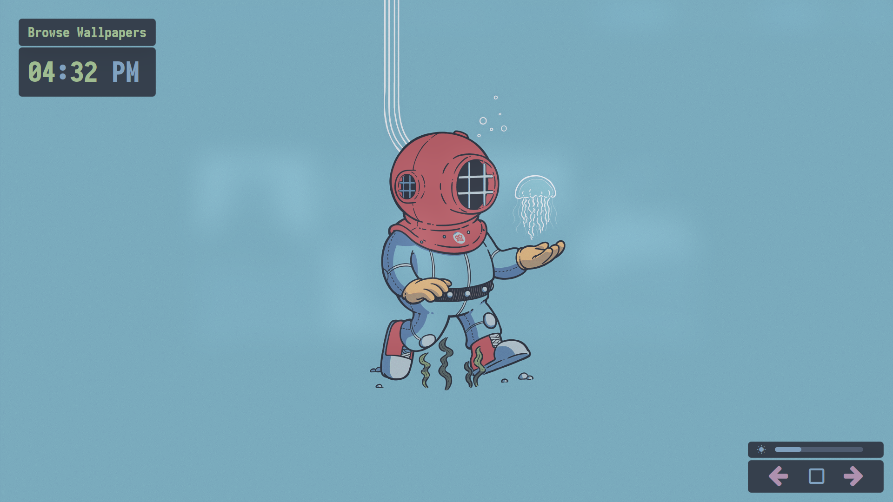

<h1 align="center"><strong>Vile</strong></h1>

My EWW configurations. All written in the new yuck configuration syntax.

## What the heck is is EWW?

[Eww](https://elkowar.github.io/eww/eww.html) (ElKowar's Wacky Widgets) is a widget system made in [Rust](https://www.rust-lang.org/), which lets you create your own widgets similarly to how you can in [AwesomeWM](https://awesomewm.org/). The key difference: It is independent of your window manager!

## Some examples

Following are some of the example of what can be achieved with EWW and what widgets will come with `vile`.

### Main utility widgets


### Wallpaper browser widgets



## How do I install this vile and disgusting configuration?

Following are the steps that are required to install this configuration to your system.

### Installing EWW (Archlinux + X11)

 1. Install the `base-devel` package first, in order to compile EWW.

    ```git
    sudo pacman -S base-devel --needed
    ```

 2. Clone the EWW github repository to your `XDG_DOWNLOADS_DIR`

    ```git
    git clone https://github.com/elkowar/eww \
                "${XDG_DOWNLOADS_DIR:-$HOME/Downloads}/eww"
    ```

 3. Move into the cloned repository directory.

    ```git
    cd "${XDG_DOWNLOADS_DIR:-$HOME/Downloads}/eww"
    ```

 4. Then build using cargo

    ```git
    cargo build --release
    ```

 5. Then change into the build directory

    ```git
    cd target/release
    ```
  
 6. Then make the EWW binary executable 

    ```git
    chmod +x ./eww
    ```

 7. Lastly Move the binary to the `$HOME/.local/bin` directory

    ```git
    mv eww "$HOME/.local/bin"
    ```

After installing EWW briefly look at their documentations and use `eww help` to see what options are available.

### Installing Vile

 1. Clone this repository to the eww configuration directory. Make sure that the directory `${XDG_CONFIG_HOME:-$HOME/.config}/eww` is completely empty.

    ```git
    git clone https://github.com/pagankeymaster/vile.git \ 
                "${XDG_CONFIG_HOME:-$HOME/.config}/eww"
    ```

 2. Then move into that directory 

    ```git
    cd "${XDG_CONFIG_HOME:-$HOME/.config}/eww"
    ```

 3. Try using one of the two launchers namely `mainlauncher` and `wallpaperlauncher` bind them to your keyboard daemon if possible.

## Few caveats

- Not everything will work out of the box you need to parse and re-adjust the `scripts` in order to make them work for your system. Also, note that the `scripts` directory is located at `XDG_CONFIG_HOME/eww/scripts`.

- This configuration was written in the early stages of `yuck` and at that time there were no comprehensive and detailed information about the `MAGIC VARIABLES` feature, which makes few of the scripts redundant. I will be refactoring such scripts later...

- I also plan to write a monolithic launcher with flags like `--main`, `--wallpaper`, etc. And, will move `mainlauncher` and `wallpaperlauncher` to a new directory called `launchers`.
