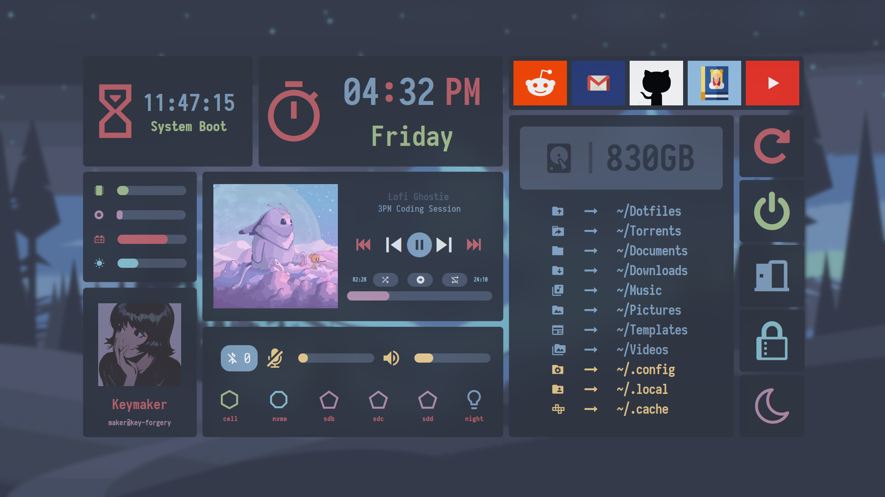
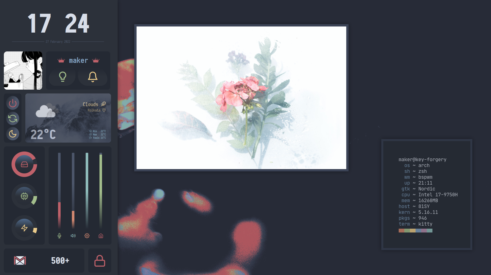
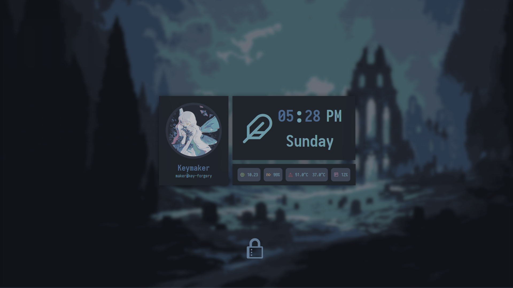
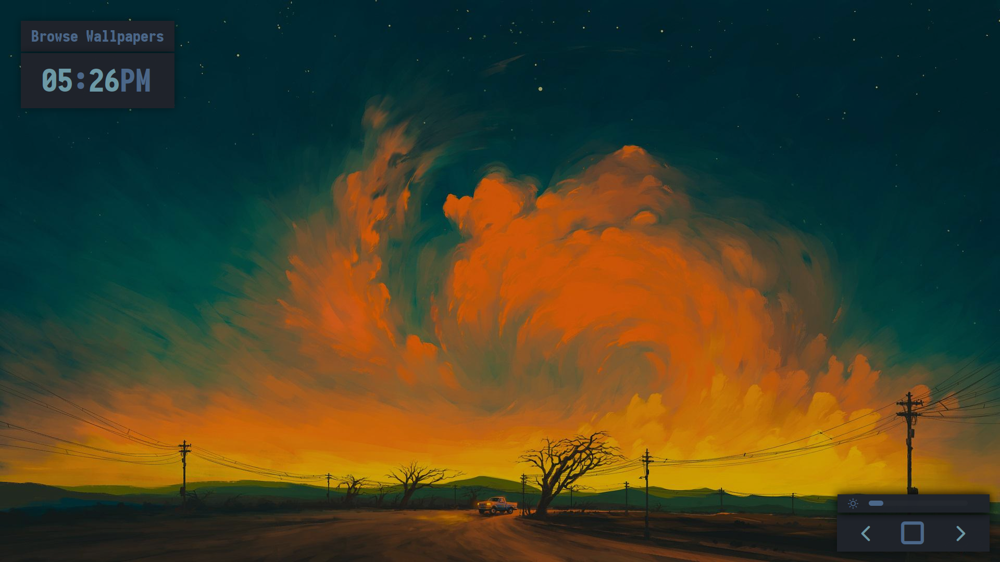
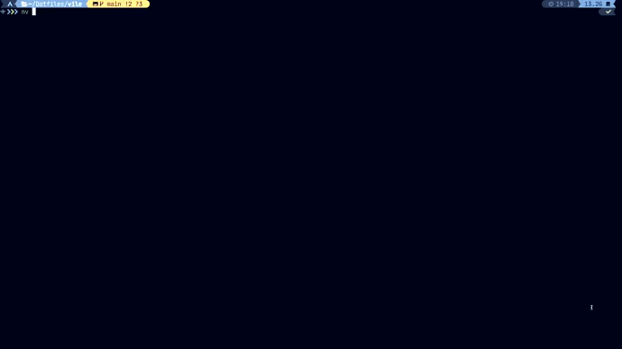

<div align="center">


</div>

##  NOTICE
Branch `rewrite` will be merged with `main` on this Sunday.

## Screenshots 

Screenshots of the widget sets. Note that all of them does exactly what you would think.

### structs/main-utils/

Dashboard widget set



### structs/side-utils/

Sidebar widget set



### structs/screen-lock/

Screen lock overlay widget. Leverages `i3-lock-color`.



### structs/wallpaper/

Wallpaper explorer widgets



## Installation

First of all install the [EWW](https://github.com/elkowar/eww) package. 
It should be available on the [AUR](https://aur.archlinux.org/packages/eww-git) by now. 
If not then install it from [here](https://elkowar.github.io/eww/).
Note, that I can only speak for Xorg albeit, 
it should also work for Wayland just follow the 
instructions in their repository.

### Conform to XDG base directory structure

It is recommended to set the XDG environment variables as my project won't work if they are
not exported. You don't need to set all of them though.

```bash
export XDG_CONFIG_HOME="$HOME/.config"
export XDG_CACHE_HOME="$HOME/.cache"
export XDG_DATA_HOME="$HOME/.local/share"
export XDG_DOWNLOAD_DIR="$HOME/Downloads"
export XDG_DOCUMENTS_DIR="$HOME/Documents"
export XDG_MUSIC_DIR="$HOME/Music"
export XDG_PICTURES_DIR="$HOME/Pictures"
```

Read more about this [here](https://wiki.archlinux.org/title/XDG_Base_Directory).

### Cloning

Clone the repo locally to `$XDG_CONFIG_HOME/eww`

```bash
git clone https://github.com/pagankeymaster/vile "$XDG_CONFIG_HOME/eww"
```

Make all of the scripts executable

```bash
chmod +x "$XDG_CONFIG_HOME/eww/scripts/*"
chmod +x "$XDG_CONFIG_HOME/eww/structs/wallpaper/wallauncher"
chmod +x "$XDG_CONFIG_HOME/eww/structs/side-utils/sidelauncher"
chmod +x "$XDG_CONFIG_HOME/eww/structs/main-utils/mainlauncher"
chmod +x "$XDG_CONFIG_HOME/eww/structs/screen-lock/locklauncher"
```

### Symbolic linking launchers (Optional)

Create the `$HOME/.local/bin` directory if it doesn't exists already.

```bash
ln -s "$XDG_CONFIG_HOME/eww/structs/side-utils/wallauncher" "$HOME/.local/bin"
ln -s "$XDG_CONFIG_HOME/eww/structs/side-utils/sidelauncher" "$HOME/.local/bin"
ln -s "$XDG_CONFIG_HOME/eww/structs/main-utils/mainlauncher" "$HOME/.local/bin"
ln -s "$XDG_CONFIG_HOME/eww/structs/screen-lock/locklauncher" "$HOME/.local/bin"
```

### Requirements

Note that as of now Python 3.10 is required for the weather script to work as, it
uses latest Python features. Sorry, for the trouble. I'll try to change that in the near future.

#### Archlinux

```
$ pacman -S dunst         \
            udisks2       \
            playerctl     \
            bluez         \
            bluez-utils   \
            redshift      \
            mpd           \
            mpc           \
            i3-lock-color \
            pulseaudio --needed
```

#### Python

```
$ pip3.10 install requests      \
                  python-dotenv \
                  dbus-python

```

### Roles 

Following are the brief descriptions of the packages that you are about to install.

 - **Redshift**: Redshift adjusts the color temperature of your screen according to your surroundings. 
   This may help your eyes hurt less if you are working in front of the screen at night. 
   Install it and follow the instructions mentioned [here](https://wiki.archlinux.org/title/Redshift).

 - **udisks**: udisks provides a daemon udisksd, that implements D-Bus interfaces used to query 
   and manipulate storage devices, and a command-line tool udisksctl, used to query and use the daemon. 
   Install it and follow the instructions mentioned [here](https://wiki.archlinux.org/title/Udisks).

 - **Dunst**: Dunst is a lightweight replacement for the notification-daemons provided by most desktop environments. 
   Install it and follow the instructions mentioned [here](https://wiki.archlinux.org/title/Udisks).

 - **Playerctl**: The playerctl utility provides a command line tool to send commands to MPRIS clients. 
   The most common commands are play-pause, next and previous. 
   Install it and follow the instructions mentioned [here](https://wiki.archlinux.org/title/MPRIS).

 - **Bluez**: BlueZ provides support for the core Bluetooth layers and protocols. 
   It is flexible, efficient and uses a modular implementation. 
   It has many interesting features.
   Install it and follow the instructions mentioned [here](https://wiki.archlinux.org/title/Bluetooth).

 - **MPD and MPC**: MPD (music player daemon) is an audio player that has a server-client architecture.
   It plays audio files, organizes playlists and maintains a music database, 
   all while using very few resources. 
   In order to interface with it, a separate client is needed.
   Install it and follow the instructions mentioned [here](https://wiki.archlinux.org/title/Music_Player_Daemon).

 - **Pulseaudio**: PulseAudio is a general purpose sound server intended to run as a middleware between 
   your applications and your hardware devices, either using ALSA or OSS. 
   While its main purpose is to ease audio configuration, its modular design allows 
   more advanced users to configure the daemon precisely to best suit their needs. 
   Install it and follow the instructions mentioned [here](https://wiki.archlinux.org/title/PulseAudio).

 - **python-dotenv**: Python-dotenv reads key-value pairs from a .env file and can set them 
   as environment variables. Learn more about it [here](https://pypi.org/project/python-dotenv/)

 - **dbus-python**: dbus-python is the original Python binding for dbus, the reference 
   implementation of the D-Bus protocol. Online documentation can be found [here](http://dbus.freedesktop.org/doc/dbus-python/). 
   And, learn more about it [here](https://pypi.org/project/dbus-python/).

 - **Requests**: Requests is a simple, yet elegant, HTTP library. Learn more about it [here](https://pypi.org/project/requests/)

## Customization

### Colorscheme

Take a look at `colors.scss` file. This file should be edited if you want to change the colorscheme. 
This file is linked to all of the submodules residing in the `structs/` directory 
so, deleting it is **not recommended**.

Additionally, the `colors.scss` file follows the [base-16](http://chriskempson.com/projects/base16/) 
color architecture albeit I haven't quite conformed to it. 
You can take a look at the following snippet to get a rough idea.

```sass
$background: #272c35;
$foreground: #d8dee9;

$color0: #242933;
$color1: #bf616a;
$color2: #a3be8c;
$color3: #ebcb8b;
$color4: #5e81ac;
$color5: #b48ead;
$color6: #88c0d0;
$color7: #e5e9f0;
$color8: #2c313a;
$color9: #d08770;
$color10: #a3be8c;
$color11: #ebcb8b;
$color12: #81a1c1;
$color13: #606672;
$color14: #8fbcbb;
$color15: #4c566a;
```

Note that you should **restart EWW** in order for the changes to take effect!

### Demonstration

<details align="center">
  <summary>The GIF is a bit fucked, which my fault. I'll fix it later but, you should be able to get what's happenning LOL.</summary>

  
</details>

## Credits

The following are the people that made making this possible. 
Do check them out if you have the time. 
Most of the widget designs are inspired from their versions.

[elkowar 👑](https://github.com/elenapan/dotfiles)

[druskus20](https://github.com/druskus20/eugh)

[ner0z](https://github.com/ner0z/dotfiles)

[adi1090x](https://github.com/adi1090x/widgets)

[iSparsh](https://github.com/iSparsh/gross)

[Axarva](https://github.com/Axarva/dotfiles-2.0)

## Todo List

End my misery.

- [ ] Add script documentations
    - [ ] bluetooth
    - [ ] coreusage
    - [ ] dunst-x
    - [ ] dunst
    - [ ] free-perc-df
    - [ ] free
    - [ ] gmail
    - [ ] microphone
    - [ ] mount
    - [ ] mpd
    - [ ] opendir
    - [ ] openlinks
    - [ ] playerctl
    - [ ] ram
    - [ ] randomize
    - [ ] redshift-toggle
    - [ ] redshift
    - [ ] temp
    - [ ] uphour
    - [ ] volume
    - [ ] wal-cache
    - [ ] wallpaper
    - [ ] weather
- [ ] Add comments in code
- [ ] Revise documentations
- [ ] Add widget animations
    - [ ] To side-utils
    - [ ] To main-utils
    - [ ] To screen-lock
    - [ ] To main-utils
- [ ] Add hover animations
    - [ ] To side-utils
    - [ ] To main-utils
    - [ ] To screen-lock
    - [ ] To main-utils
- [ ] Refine and re-write old widgets
    - [ ] Refine side-utils
    - [ ] Refine main-utils
    - [ ] Refine screen-lock
    - [ ] Refine main-utils
- [ ] Refine and re-write scripts
    - [ ] bluetooth
    - [ ] coreusage
    - [ ] dunst-x
    - [ ] dunst
    - [ ] free-perc-df
    - [ ] free
    - [ ] gmail
    - [ ] microphone
    - [ ] mount
    - [ ] mpd
    - [ ] opendir
    - [ ] openlinks
    - [ ] playerctl
    - [ ] ram
    - [ ] randomize
    - [ ] redshift-toggle
    - [ ] redshift
    - [ ] temp
    - [ ] uphour
    - [ ] volume
    - [ ] wal-cache
    - [ ] wallpaper
    - [ ] weather
- [ ] Delete cache files
- [ ] Add statusbar widget
- [ ] Add a todolist widget
- [ ] Add a pomodoro widget
- [ ] Add a xrandr interface
- [ ] Revise, format and cleanup

<!--
  vim:ft=markdown
-->
