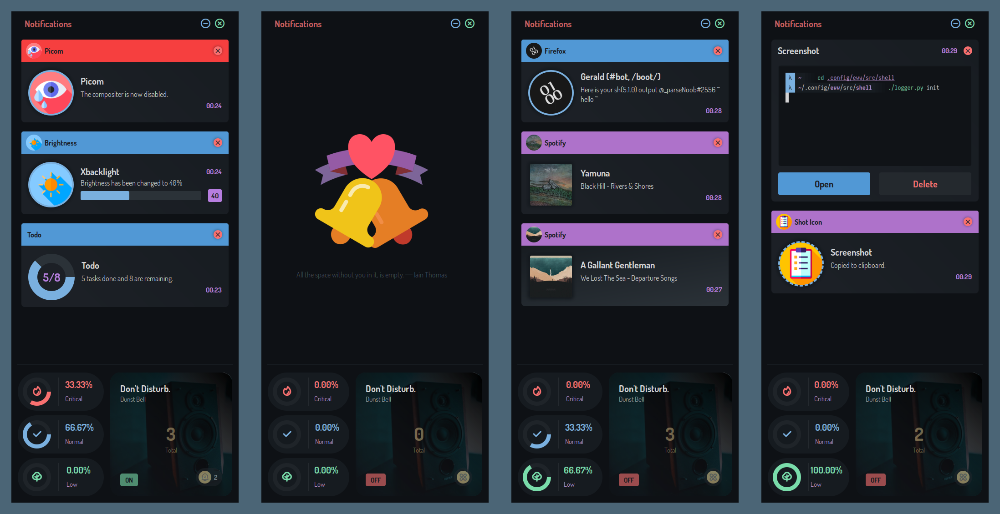

<details>
  <summary><samp>screenshots and demo</samp></summary>
  
  
</details>

---

<samp>assumptions</samp>

```
- you are on arch
- you use bspwm
- you use sxhkd
- you use picom
- eww binary is already installed
```

<samp>env vars</samp>

```sh
export TERMINAL=st
export BROWSER=firefox
export VISUAL=nvim
export EDITOR=nvim
export XDG_CONFIG_HOME="$HOME/.config"
export XDG_CACHE_HOME="$HOME/.cache"
export XDG_DATA_HOME="$HOME/.local/share"
export XDG_DOWNLOAD_DIR="$HOME/Downloads"
export XDG_MUSIC_DIR="$HOME/Music"
export XDG_PICTURES_DIR="$HOME/Pictures"

# SEE: https://wiki.archlinux.org/title/Xdg-utils
# SEE: https://wiki.archlinux.org/title/XDG_user_directories
# SEE: https://wiki.archlinux.org/title/Environment_variables
```

<samp>vertigo deps</samp>

```sh
yay -S zsh pamixer redshift rofi --needed
```

<samp>disclose deps</samp>

```sh
yay -S dunst-git gobject-introspection python python-pip --needed
pip install -r path/to/vile/requirements.txt
```

<samp>avatar deps</samp>

```sh
yay -S mpd mpc playerctl dunst-git gobject-introspection python python-pip \
  imagemagick --needed
pip install -r path/to/vile/requirements.txt

# NOTE: dunst, playerctl and mpd needs to be always running.
```

<samp>ocular deps</samp>

```sh
none
```

<samp>lumin deps</samp>

```sh
none
```

<samp>origin deps</samp>

```sh
none
```

<samp>melody deps</samp>

```sh
yay -S gobject-introspection python python-pip playerctl --needed
```

<samp>some important notes</samp>

```
- recheck and verify all vile/.config.json values.
- recheck and verify all _layout.yuck values.
```
