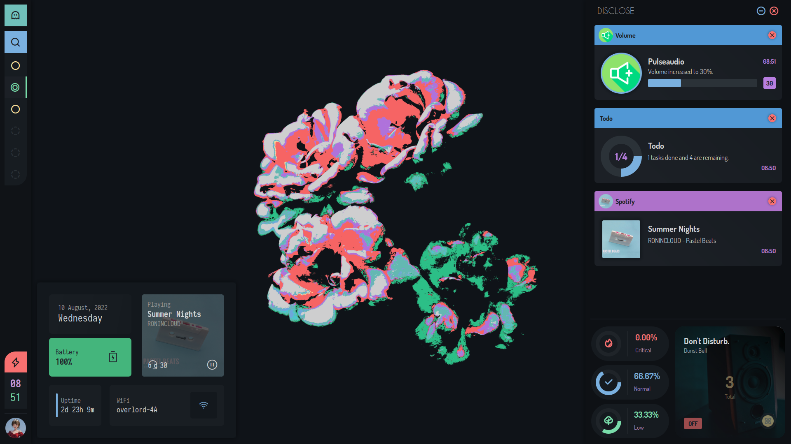

<div align="center">

[](https://github.com/dharmx/vile)

[](https://github.com/dharmx/vile/issues)
[](github.com/dharmx/vile) 
[](https://github.com/dharmx/vile/stargazers)
[](https://github.com/dharmx/vile/commits) 

</div>

---

# 👋 Introduction

Greetings, visitors. This is a repository of various useless GUI [widgets](https://www.merriam-webster.com/dictionary/widget) that may or, may not enchance the look of your current desktop interface.
I will walk you through each and every step of the installation process so, make sure to hit that lik- follow everything in a step-by-step fashion.

And if are here to borrow code then you may skip this README.

## 🚒 Procedure

A brief explanation of explanation (explanception!). This section is optional but it wouldn't hurt to gloss over it.

 - Introduction, brief description and greetings.
 - Procedure, explanception.
 - Showcase. Brief showcase, two screenshots of the project in action.
 - Assumptions. Conditions and constraints.
 - Structure. Project structure and design decisions.
 - <samp>MAKE IT STOP!</samp>
 - Dependencies. Modules, packages, scripts and resources that are required.
 - Configuration. The main shit.
 - Hacking. Advanced configuration.
 - Gallery.
 - End Goals.
 - Not Goals.
 - Tips. Useless shit.
 - FAQ.
 - Credits. Acknowledgements.
 - TODOs.
 - License.

---

## 🖼 Showcase



## 🤔 Assumptions

List of conditions and constraints that are needed to be fulfilled.
This section solely to reduce some headaches.
This is done because I do not want to spend an extensive amount of time writing instructions for several Linux distributions.

I will choose Archlinux as a reference frame as I have only used Archlinux, Manjarno and EndeavourOS in the past.
So, following are roughly some assumptions that I will follow:

  - You are using either Archlinux or, an Arch-based distro like Manjaro.
  - You already have an editor, a browser and necessary utilities installed like `sudo, git, etc`.
  - You have `python` installed.
  - You are using an [AUR helper](https://wiki.archlinux.org/title/AUR_helpers).
  - You are using `bspwm` as your [window manager](https://wiki.archlinux.org/title/Window_manager).
  - You are using `sxhkd` as your [keyboard daemon](https://wiki.archlinux.org/title/Keyboard_shortcuts).
  - You use pulseaudio.

## 🌿 Structure

This is an important section for those who want to borrow some piece of functionality for use in their projets.
This section will paint a general idea of how stuff is being linked to one another so, you can have a general idea
for handling or, understanding a bug if one appears (which it will at some point).

---

### 🌿 General structure

```
├── assets
├── src
│   ├── scss
│   ├── shell
│   └── yuck
└── themes
```

 - `assets` contains images, graphics and svgs for use in the project.
 - `src.scss` contains all theming files. Theming is done using [SCSS](https://sass-lang.com/). So, all of the files in this directory will also be SCSS.
 - `src.yuck` contains markup files, all of which are of YUCK filetype.
 - `src.shell` contains various scripts.
 - `themes` this will also contain only SCSS files. <samp>Why not have them in src.scss then?</samp> Because organization. That's it.

### 🌿 `src` substructure

This structure will seem familiar to webdevs.

```
src
├── scss
│   ├── _base.scss
│   ├── _override.scss
│   ├── avatar
│   ├── bolt
│   ├── chrono
│   ├── clime
│   ├── disclose
│   ├── horizon
│   ├── lumin
│   ├── melody
│   ├── ocular
│   ├── origin
│   ├── power
│   └── vertigo
└── yuck
    ├── _env.yuck
    ├── _lib.yuck
    ├── avatar
    ├── bolt
    ├── chrono
    ├── clime
    ├── disclose
    ├── horizon
    ├── lumin
    ├── melody
    ├── ocular
    ├── origin
    ├── power
    └── vertigo
```

As you might have guessed.
The **modules** in the `scss` directory, style the classes that are defined in the yuck directory.
For instance, the module `lumin` will have `scss.lumin` which will contain styling specific to widgets defined in `yuck.lumin` only.

### 📚 Style Overrides

There is a `_override.scss` file which supplied for the purpose of overriding and testing your own stylings.
I have made this in order to contain different designs for the same widget.


The above is the transparent version of the bar which is different to that shown in the showcase.

---

## 🔽 Dependencies

This section is divided into 2 parts:

 - Main Dependencies
 - Python Dependencies

### 🔽 Main Dependencies

Execute this in your terminal <samp>(if you dare.)</samp>.

```sh
yay --sync base-devel rustup python python-pip eww-git  \
  dunst bspwm sxkhd gobject-introspection imagemagick   \
  mpd mpc playerctl pamixer rofi redshift zsh --needed
# NOTE: use paru or, a AUR helper of your choice or, do the dirty work yourself.
```

 - Rustup is needed for compiling 
 - For [pipewire](https://wiki.archlinux.org/title/PipeWire) users you need to replace all of the matches of [`pamixer`](https://github.com/cdemoulins/pamixer) in 
   this repository with appropriate commands. You may use [`nvim-telescope's live-grep`](https://github.com/nvim-telescope/telescope.nvim) 
   feature to get the matches conveniently and elegantly.
 - For [dunst](dunst-project.org) you need to have have a specific configuration, which you can grab from the samples section.
 - And it should be a given that [`bspwm`](https://wiki.archlinux.org/title/Bspwm) and [`sxkhd`](https://wiki.archlinux.org/title/Sxhkd) are already configured.

### 🔽 Python Dependencies

Inspect the packages that you are about to install from [`requirements.txt`](https://github.com/dharmx/vile/blob/main/requirements.txt).
Then run the following command in your terminal while in `vile's` root.

```sh
pip install --requirement=requirements.txt
```

<br>
<br>

<div align="center">

# ⚠ UNDER CONSTRUCTION ⚠

<div>
